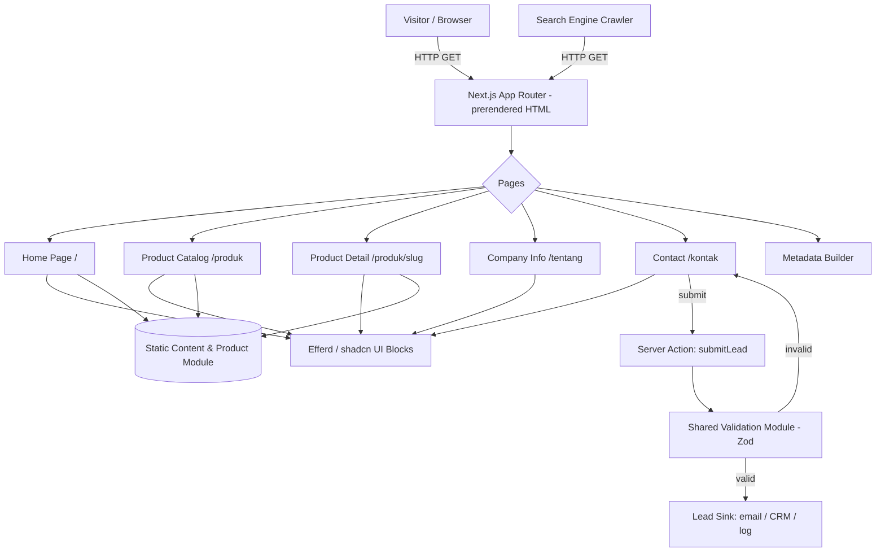

# Design Document

## Overview

This document describes the technical design for the **BantuGrow company profile website** — a fast, SEO-friendly marketing site that introduces the BantuGrow brand, presents its catalog of SaaS products for Indonesian UMKM, and converts visitors into leads through a contact form.

The site is a content-driven marketing website with a small, fixed catalog of products. There is no end-user authentication, no product application logic, and no large dynamic dataset. The two areas that contain real logic are (1) **lead capture** (contact form validation + submission) and (2) **content/data shaping** (product lookup, catalog/detail view models, SEO metadata, and the product-aware contact CTA). The design isolates this logic into pure functions so it can be tested independently of the UI.

### Key Design Decisions

| Decision | Choice | Rationale |
|---|---|---|
| Framework | **Next.js (App Router) + React + TypeScript** | Efferd blocks are React/shadcn and explicitly support Next.js. App Router gives static generation (SSG) for fast above-the-fold rendering (Req 8.1) and server-rendered HTML so crawlers get primary content in the initial response (Req 9.3). |
| UI assembly | **shadcn/ui + Efferd blocks** installed via `npx shadcn@latest add @efferd/<block>` | Pre-built, responsive, accessible sections give consistent styling and fast delivery (Req 8.3, 7.x). Zero abstraction — code lives in the repo and is fully customizable for Indonesian copy. |
| Styling | **Tailwind CSS** (shadcn default) + design tokens | Consistent theming across all blocks; responsive utilities cover the breakpoint requirements (Req 7). |
| Icons | **Lucide** (Efferd default) | Default icon set used by Efferd blocks. |
| Product data | **Static typed content module** (TypeScript data file) | The catalog is small and changes rarely; static data enables full static generation, instant lookups, and trivially correct rendering. No database needed. |
| Lead capture | **Next.js Server Action / Route Handler** with shared validation module (Zod) | Server-side validation and recording of leads; the same validation schema is reused client-side for inline messages. Pluggable sink (email/CRM/log) behind one interface. |
| Rendering strategy | **SSG for all marketing pages**, dynamic only for form submission | Pre-rendered HTML satisfies performance and SEO requirements. |
| Language | Indonesian copy stored in a central content module | Keeps user-facing text in one place; satisfies Req 1.4 and supports future localization. |

### Research Summary

- **Efferd** ([efferd.com](https://efferd.com/)) is a shadcn/ui block library of 130+ pre-built sections across ~14 categories (headers, heroes, features, CTAs, FAQs, footers, pricing, testimonials, logo clouds, contact sections, galleries, forms, error pages, not-found pages). Blocks are installed individually through the shadcn CLI registry (`@efferd/<block-name>`), drop their source directly into the project (no npm runtime package), and are compatible with Next.js and Radix/Base UI primitives. *Content was rephrased for compliance with licensing restrictions.*
- This maps cleanly onto the page structure below: each requirement section corresponds to an Efferd block category, so the site can be assembled almost entirely from pre-built sections with only copy and data substitution.

## Architecture

The website is a statically generated Next.js application. Marketing pages are pre-rendered at build time from a static content/product module. The only runtime server interaction is the contact form submission, handled by a server action that validates input and forwards the lead to a configurable sink.



### Layers

1. **Presentation layer** — Next.js pages and Efferd/shadcn blocks. Responsible only for rendering view models and forwarding form events. Contains no business logic.
2. **Domain/logic layer (pure functions)** — product lookup, catalog/detail view-model builders, the product-aware contact-CTA link builder, contact-form validation, and SEO metadata builders. Fully unit- and property-testable without a DOM.
3. **Content/data layer** — the static product module and the central Indonesian copy module.
4. **Integration layer** — the lead sink behind a single `LeadSink` interface (default implementation logs/sends email; swappable for a CRM later).

## Components and Interfaces

### Page Structure & Routing

| Route | Page | Purpose | Requirements |
|---|---|---|---|
| `/` | Home | Brand intro, product highlights, value proposition, primary CTA | 1.1–1.5 |
| `/produk` | Product Catalog | Grid of all product cards with niche labels | 3.1–3.4 |
| `/produk/[slug]` | Product Detail | Full product info, features, product-aware contact CTA | 4.1–4.3 |
| `/tentang` | Company Info | Mission, focus on UMKM, contact channels | 6.1–6.2 |
| `/kontak` | Contact | Lead-capture form (optionally pre-selected product) | 5.1–5.5 |
| `*` (not found) | 404 | Not-found message + link back | 4.3 |

A persistent `Navigation_Menu` (header) and `Footer` wrap every route via the root layout (Req 2.1, 2.5).

### Efferd / shadcn Block Selection

Blocks are installed via `npx shadcn@latest add @efferd/<block>` and then populated with Indonesian copy and product data.

| Site element | Efferd block category | Notes |
|---|---|---|
| Header / `Navigation_Menu` | **Header** block | Includes desktop nav + mobile collapsible menu control (Req 2.4). Links: Home, Produk, Tentang, Kontak. |
| Hero (Home) | **Hero** block | Headline, supporting description, primary CTA → `/kontak` (Req 1.1, 1.5). |
| Product highlights (Home) | **Features** / cards block | Summarized product list with name + short description (Req 1.2). |
| Value proposition (Home) | **Features** / **CTA** block | UMKM value messaging (Req 1.3). |
| Catalog grid | **Gallery** / cards block | One card per product: name, short description, niche label, link (Req 3.1, 3.3). |
| Catalog empty state | Inline message component | Shown when no products available (Req 3.4). |
| Product detail | **Feature** + **CTA** blocks | Name, full description, feature list, product-aware CTA (Req 4.1, 4.2). |
| Company info | **About / Features** + **Contact** block | Mission + contact channels incl. email (Req 6.1, 6.2). |
| Contact form | **Contact / Form** block | Name, email, message, subject (product) fields (Req 5.1–5.5). |
| Footer | **Footer** block | Company info, nav links, contact details (Req 2.5). |
| 404 | **Not-found** block | Message + link to catalog (Req 4.3). |

### Module Interfaces (logic layer)

```typescript
// content/products.ts — static data source
export interface Product {
  slug: string;            // URL-safe unique id, e.g. "mutabaah-digital"
  name: string;            // e.g. "Mutaba'ah Digital"
  niche: string;           // business niche label, e.g. "Ibadah & Komunitas"
  shortDescription: string;// catalog/home summary text
  fullDescription: string; // detail page body
  features: string[];      // key features (non-empty list for a real product)
}

export const products: Product[];

// lib/catalog.ts — pure lookup & view models
export function getAllProducts(): Product[];
export function getProductBySlug(slug: string): Product | undefined;

export interface ProductCardVM { slug: string; name: string; shortDescription: string; niche: string; href: string; }
export function buildCatalogView(products: Product[]): ProductCardVM[];

export interface ProductDetailVM { name: string; fullDescription: string; features: string[]; contactHref: string; }
export function buildDetailView(product: Product): ProductDetailVM;

// lib/contact-link.ts — product-aware CTA round trip
export function buildContactHref(productSlug?: string): string;     // e.g. "/kontak?produk=pos"
export function parseContactSubject(query: URLSearchParams, products: Product[]): Product | undefined;

// lib/contact-validation.ts — shared client+server validation
export interface ContactInput { name: string; email: string; message: string; productSlug?: string; }
export interface FieldError { field: "name" | "email" | "message"; code: "required" | "invalid_email"; }
export interface ValidationResult { ok: boolean; errors: FieldError[]; values: ContactInput; } // values always echoed back
export function validateContact(input: ContactInput): ValidationResult;
export function isValidEmail(email: string): boolean;

// lib/lead-sink.ts — integration boundary
export interface Lead extends ContactInput { receivedAt: string; }
export interface LeadSink { record(lead: Lead): Promise<void>; }

// lib/seo.ts — metadata builders
export interface PageMeta { title: string; description: string; }
export function homeMeta(): PageMeta;
export function catalogMeta(): PageMeta;
export function productMeta(product: Product): PageMeta;
```

The contact server action composes these: `validateContact` → on success build `Lead` → `LeadSink.record` → return confirmation; on failure return the `ValidationResult` (with echoed values) for inline display.

## Data Models

### Product (static content)

| Field | Type | Constraints |
|---|---|---|
| `slug` | string | Unique across catalog, URL-safe, non-empty |
| `name` | string | Non-empty, displayed in Indonesian |
| `niche` | string | Non-empty business niche label |
| `shortDescription` | string | Non-empty summary |
| `fullDescription` | string | Non-empty detail body |
| `features` | string[] | Each entry non-empty |

Seed products (initial catalog): Mutaba'ah Digital, Management Travel Umroh, POS — extensible by adding entries to the module.

### ContactInput / Lead

| Field | Type | Required | Validation |
|---|---|---|---|
| `name` | string | Yes | Non-empty after trim |
| `email` | string | Yes | Non-empty after trim AND valid email format |
| `message` | string | Yes | Non-empty after trim |
| `productSlug` | string? | No | If present, must match an existing product (used to pre-select subject) |
| `receivedAt` | ISO timestamp | (Lead only) | Set server-side on successful record |

### View Models

`ProductCardVM` and `ProductDetailVM` are derived projections of `Product` (see interfaces above). `href` and `contactHref` are derived deterministically from `slug`. `PageMeta` carries the per-page `title` and `description` for SEO.


## Correctness Properties

*A property is a characteristic or behavior that should hold true across all valid executions of a system — essentially, a formal statement about what the system should do. Properties serve as the bridge between human-readable specifications and machine-verifiable correctness guarantees.*

These properties target the pure logic layer (product lookup, view-model builders, the contact-CTA round trip, validation, and metadata). UI rendering, responsive layout, performance, image pipeline, and SSR delivery are validated by example, snapshot, integration, and smoke tests instead (see Testing Strategy).

### Property 1: Catalog view-model completeness

*For any* list of products, `buildCatalogView` produces exactly one card per product, in which each card contains that product's name, short description, and niche label, and a detail link equal to `/produk/{slug}`.

**Validates: Requirements 3.1, 3.3**

### Property 2: Product detail view-model completeness

*For any* product, `buildDetailView` produces a view model that contains the product's name, its full description, and every entry in the product's feature list (no feature dropped, none added).

**Validates: Requirements 1.2, 4.1**

### Property 3: Product lookup found / not-found

*For any* catalog of products with unique slugs and *for any* slug, `getProductBySlug` returns a product whose slug equals the queried slug when that slug exists in the catalog, and returns undefined (triggering the not-found view) for any slug not present in the catalog.

**Validates: Requirements 3.2, 4.3**

### Property 4: Contact-CTA product round trip

*For any* product in the catalog, parsing the contact query produced by `buildContactHref(product.slug)` with `parseContactSubject` recovers that same product as the pre-selected inquiry subject; and `buildContactHref(undefined)` parses back to no pre-selected subject.

**Validates: Requirements 4.2, 5.5**

### Property 5: Email format validation

*For any* string, `isValidEmail` returns true if and only if the string is a well-formed email address; well-formed addresses are accepted and malformed strings (missing `@`, missing domain, whitespace-only, empty) are rejected.

**Validates: Requirements 5.4**

### Property 6: Contact validation completeness and value retention

*For any* `ContactInput`, `validateContact` returns `ok = true` if and only if `name`, `email`, and `message` are all non-empty after trimming and `email` is a valid format; when `ok = false`, the returned `errors` identify exactly the offending fields (each empty required field as `required`, an invalid email as `invalid_email`) with no missing or spurious entries; and in every case `result.values` equals the originally submitted input (entered values are retained).

**Validates: Requirements 5.2, 5.3, 5.4**

### Property 7: SEO metadata presence and title uniqueness

*For any* catalog of products with unique slugs and names, the metadata built for the Home page, the Catalog page, and every Product detail page each has a non-empty title and a non-empty description, and all of these titles are pairwise distinct.

**Validates: Requirements 9.1**

### Property 8: Single primary heading per page

*For any* page in the site (Home, Catalog, Company, Contact, and every Product detail page), the rendered output exposes exactly one primary heading (`h1`).

**Validates: Requirements 9.2**

## Error Handling

| Scenario | Handling | Requirement |
|---|---|---|
| Empty / whitespace required field on contact form | `validateContact` returns `ok=false` with a `required` error per empty field; UI shows inline messages and re-renders with `result.values` so input is retained | 5.3 |
| Invalid email format | `validateContact` returns an `invalid_email` error for the email field; inline message shown; other entered values retained | 5.4 |
| Lead sink failure (email/CRM unavailable) | Server action catches the error, logs it, and returns a non-blocking failure state so the visitor sees a "please try again" message rather than a crash; validated input is preserved | 5.2 |
| Product detail requested for unknown slug | `getProductBySlug` returns undefined; the route renders the not-found view with the message and a link back to `/produk` rendered together (message only shown when the link is also present) | 4.3 |
| Empty / failed-to-load catalog | `buildCatalogView([])` yields an empty result; catalog page renders the "no products available" message instead of an empty grid | 3.4 |
| Unknown route | Global `not-found` page renders message + link to catalog | 4.3 |

Validation is centralized in one module shared by client and server so client-side and server-side messages cannot diverge.

## Testing Strategy

A dual approach: **property-based tests** verify the universal logic above across many generated inputs; **example, snapshot, integration, and smoke tests** cover fixed UI structure, responsive layout, the image pipeline, and SSR delivery where universal properties do not apply.

### Property-Based Tests

- **Library:** `fast-check` integrated with the test runner (`vitest`), the standard PBT library for the TypeScript/Next.js stack — not implemented from scratch.
- **Iterations:** Each property test runs a minimum of **100 generated cases**.
- **Tagging:** Each property test is tagged with a comment referencing its design property, format: `Feature: bantugrow-company-profile, Property {number}: {property_text}`.
- **Coverage:** One property-based test per correctness property (Properties 1–8). Generators produce random products (varying feature counts, special characters, Indonesian text), random catalogs with unique slugs, and random `ContactInput` values including empty/whitespace fields and malformed emails. Property 8's "for any page" is realized by parameterizing over the full page set including a generated product detail.

### Example & Edge-Case Unit Tests

- Home renders hero (headline, description, CTA → `/kontak`), product highlights, and value-proposition section (Req 1.1, 1.3, 1.5).
- Navigation exposes the four required links and a working mobile collapsible control; footer renders required content (Req 2.1–2.5).
- Contact form renders name, email, and message fields (Req 5.1).
- Company page shows mission and an email contact channel (Req 6.1, 6.2).
- Empty-catalog edge case renders the no-products message (Req 3.4).
- Not-found view renders message together with the catalog link (Req 4.3).

### Snapshot / Responsive Tests

- Snapshot tests for assembled Efferd blocks to catch unintended visual regressions (Req 8.3).
- Responsive checks at desktop and mobile viewports verify single-column mobile layout and reachable controls (Req 7.1–7.3, 2.4).

### Integration Tests

- Build the site and fetch representative routes (Home, Catalog, a Product detail), asserting primary content is present in the server-rendered HTML without client JS (Req 9.3).
- Verify `next/image` emits compressed, breakpoint-sized responsive output for a sample image (Req 8.2).
- Contact server action end-to-end: valid submission invokes `LeadSink.record` and returns confirmation; sink failure returns the graceful error state (Req 5.2).

### Smoke / Performance Checks

- Lighthouse / performance-budget check in CI asserting above-the-fold render within the 3-second target on a broadband profile (Req 8.1).
- Content/locale review confirming primary copy is Indonesian (Req 1.4).
